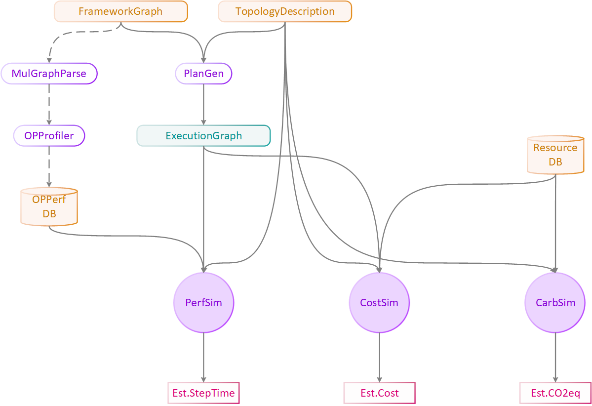

# AISim
> _An AI Infrastructure Simulator/Evaluator_
> 
> _Reversion 2.0.0_
---
## 1 Overview

### 1.1 Background

AI training is occupying a large amount of data center usage in these days, and we are observing a rapid growth in this field. This trend is demanding a evolution in all areas related to AI cloud computing philosophy, including tooling, algorithm, silicons, methodology, etc.

For CSP (Cloud Service Providers), this change is not only a challenge to the existing business model, but also a good opportunity to find a new system solution to satisfy customers' requirement change. CSP should navigate among different infrastructure buildup and operation options, like what computing silicon will be integrated, what topology and bandwidth they should be connected to, what communication protocol will be used for distributed training, and so on. All these options should be considered having significant impact to the infrastructure, regarding to what performance it can achieve, how much money will be spent on the building and operation phase, how the infrastructure will affect climate. All these impacts are crucial to customer serving and business growth.

### 1.2 Motivation

While navigating through these options is not easy to achieve in real world. Here we listed some obstacles.

- Requires huge investment on budget, manpower, and time, this will potentially delay to system online date.
- Non-feasible for options with unreleased technologies and devices, this will limit CSP's Competitiveness.

To better illustrate these, here we will describe two hypothetical but reasonable scenarios.

- Scenario 1: A new device with better performance will be released, CSP need to decide whether to deploy the up-coming device into the next generation infrastructure. Some questions are: Should we change other parts to bring out the best performance of this device? How much gain will customers experience?

- Scenario 2: A customer is about to make decision among different VM choices provided by the CSP. Some questions are: How would I know which configuration is more suitable to my workload? How much budget should the customer plan for the training?

All of them are very realistic questions from both CSP and customer and it would be great helpful if  proper answers/suggestions can be made. But we have not seen a systematical method that meets such requirements by giving quantitative answers. 

### 1.3 Concept of AISim

AISim is a infrastructure evaluator, by simulating the performance, cost, and carbon footprint of a giving infrastructure design. It can provide a quantitative evaluation from both CSP view and customer view, covering the metrics of great interest, including performance, cost, and environment impact of the infrastructure.

AISim would benefit users via providing suggestions to make a valuable purchase, inspire CSPs to build and operate at great efficiency, and impact public by showing considerable responsibility to the climate.

## 2 Design

In this section we will give the design of AISim, including the architecture, important definitions, component diagrams, workflow and interfaces.

### 2.1 Architecture

**AISim = PerfSim + CostSim + CarbSim**

AISim consists three major building sub-components, They are:

- PerfSim - Aiming to provide accurate estimation of the AI model training step time for a given infrastructure.

- CostSim – Aiming to provide buildup and operation cost by considering all possible factors related to AI infrastructure.

- CarbSim - Aiming to provide the estimation of carbon footprint during the buildup and operation of the AI infrastructure.

In below we give the whole AISim architecture diagram.

 *F2.1 AISim Diagram*

### 2.2 Definitions

[comment]: <> (Infrastructure scope)

* **Infrastructure**
  
  An **Infrastructure** is xxx

* **Rack**
  
  A **Rack** is xxx

* **Node**
  
  A **Node** is xxx

* **Topology**
  
  A **Topology** may refer to **NetworkTopology** describing the connecting among Nodes, or **GPUTopology** describing the connecting within a Node.

[comment]: <> (AI scope)

* **Graph**
 
  A **Graph** is DAG describing a specific AI model structure. there are only **GraphNode** and **GraphLink** in it.

  * **FrameworkGraph** is the default DAG from a common framework such as TersorFlow, PyTorch
  * **ExecutionGraph** is xxx
  

### 2.3 Component Diagrams

This document is aiming to describe the scope and boundary for clarity, for detailed component diagrams please refer to PerfSimDesign.md CostSimDesign.md CarbSimDesign.md separately. [editing: add links]

### 2.4 Workflow

### 2.5 Interfaces

#### 2.5.1 Input
	
| Name                | Usage         | Comment |
|:--------------------|:--------------|:--------|
| FrameworkGraph | The model graph from a general ML framework, then it will be used to generate the ExecutionGraph, within which the communication ops are replaced with send/receive primitives |  |
| OPPerfDB | Per computing device OP performance |  |
| TopologyDescription | A .dot file describing the topology of the data center (Graph Description Language (dot)) |  |
| ResourceDB | Organized database for cost/tdp/carbon/afr |  |

#### 2.5.2 Output

| Name                | Usage         | Comment |
|:--------------------|:--------------|:--------|
| Est.StepTime | Estimated model training step time in second |  |
| EstimatedCost | Estimated buildup cost and operation cost |  (structure) |
| EstimatedCO2eq | Estimated carbon footprint |  |

## 3 Component A

## 4 Component B

## 5 Implementation and Source Code

## 6 Appendix
